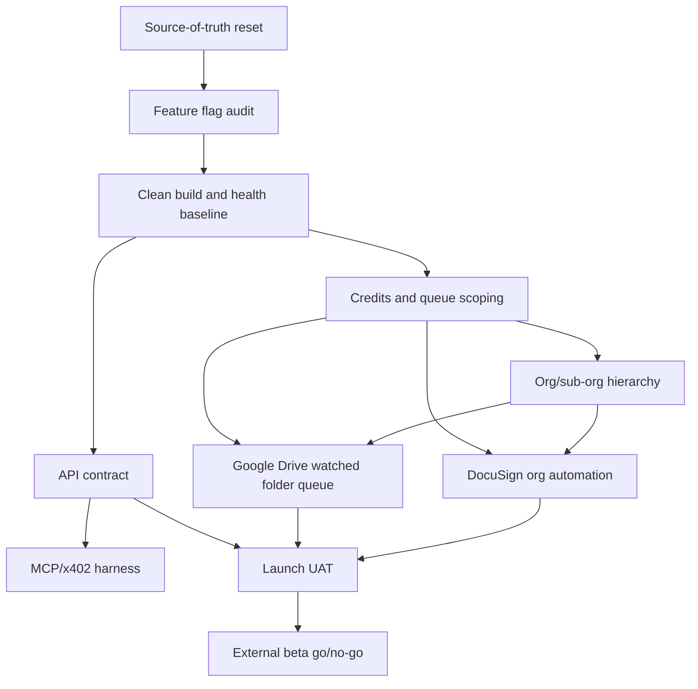

# Arkova First-Client Launch Command Center

Date: 2026-05-01
Status: Active operating plan
Audience: Product, engineering, operations, sales

## Purpose

This is the execution layer for first-client beta readiness. The PRD packet defines the target state. The traceability audit identifies where story status, code reality, and customer promises drift. This command center turns those documents into a working launch board.

Use this document to decide what happens next, what is allowed to wait, and what cannot be called Done without evidence.

## Non-Negotiable Rule

No degradation and no deferral for first-client launch commitments.

For this launch, a workflow is either:

1. In beta scope and operationally proven.
2. Out of beta scope and removed from customer-facing claims.
3. Blocked with a named remediation story, owner, and launch gate.

There is no fourth state where a customer discovers the gap for us.

## Source Of Truth Order

When sources conflict, use this order:

1. Current code and current production/staging runtime behavior.
2. Current handoff and dated audit docs.
3. Active PRD/launch command center.
4. Story docs and Jira issues.
5. Story archive and historic Done counts.

Archive Done counts do not prove launch readiness.

## Launch Scope Freeze

These are the workflows that should be treated as first-client beta scope unless explicitly removed from the launch promise.

| Area | Beta promise | Launch standard |
| --- | --- | --- |
| DocuSign automation | Completed contracts from every relevant DocuSign organization member are captured by Arkova and routed to instant anchor or queue. | Multi-user org account test, HMAC validation, idempotency, envelope/document fetch, rule action support, volume test. |
| Google Drive automation | Files updated in configured folders are added to the admin queue for review and batch processing. | OAuth, webhook/change polling, folder matching, queue item creation, bulk approve/reject, daily digest, on-demand and scheduled runs. |
| Credits and Bitcoin cost control | Organizations receive monthly credits; instant anchors consume credits; queue/batch paths control cost. | Enforced ledger, org/sub-org allocations, visibility, alerts, no unlimited high-volume path. |
| Org/sub-org hierarchy | Org admins can manage sub-orgs, delegate anchors/credits, revoke sub-orgs, and view rollups. | Role matrix, scoped dashboards, delegated limits, revocation behavior, cross-org isolation tests. |
| Queueing | Org queue and platform queue behave predictably and safely. | Manual org run is org-scoped, platform batch is explicit, scheduler is durable, queue state is auditable. |
| API | API returns accurate, useful, stable responses for customers and agents. | Contract tests, SDK parity, no internal UUID leakage, examples, API-key auth tests. |
| Admin navigation | Admins land on the correct dashboard and navigation routes are role-aware. | Post-login route tests and dashboard smoke tests. |
| Performance | Core workflows are usable under expected first-client load. | p95 budgets, worker/queue throughput tests, production health visibility. |

Out of beta scope unless separately sold or explicitly pulled in:

- Compliance intelligence / Nessie jurisdictional recommendations.
- White labeling.
- Carfax-style reports.
- Clio, Greenhouse, Lever full connectors.
- General MCP connector ecosystem launch.
- x402 paid agentic API access.

## Recommended Sequence

This is the script. Do not jump ahead unless a later item is the only way to unblock an earlier item.

| Order | Workstream | Why it comes here | Output |
| --- | --- | --- | --- |
| 0 | Command center and source-of-truth reset | The team needs one operating board before coding against stale Done labels. | This document, linked PRD/audit docs, launch story map. |
| 1 | Feature flag and kill switch audit | We must know what is off, what is safe to enable, and what still breaks when enabled. | Canonical flag registry, launch values, readiness endpoint, CI drift check. |
| 2 | Clean build, health, and performance baseline | If the app is slow or degraded, connector work cannot be trusted. | Clean typecheck/build, health dashboard, p95 budgets, current failure list. |
| 3 | Credits and queue scoping | These protect cost and data isolation before automation increases volume. | Enforced credits, org-scoped queue claims, platform batch separation, scheduler. |
| 4 | Org/sub-org hierarchy | Connectors, credits, dashboards, and API scopes need the hierarchy model to be correct. | Role matrix, admin dashboards, delegation, revocation, isolation tests. |
| 5 | DocuSign and Google Drive | Automation becomes safe only after flags, queue, credits, and org scoping are ready. | Operational connectors with multi-user, volume, idempotency, queue/anchor tests. |
| 6 | API contract and MCP/x402 validation | API is launch-critical; MCP/x402 is strategic but should trail core beta readiness. | Rich API contract, SDK parity, agentic test harness, payment scope decision. |
| 7 | Navigation, UAT, sales copy, and go/no-go | The customer-facing experience and claims must match what is actually enabled. | UAT evidence, route tests, launch checklist, corrected beta copy. |

## Active Launch Board

| Priority | Lane | Story / Epic | Status | Required next action | Done means |
| --- | --- | --- | --- | --- | --- |
| P0 | Launch control | LAUNCH-CONTROL-01 - Source-of-truth reset | In progress | Keep this command center current; map every launch promise to a live Jira story or existing epic. | No beta-scope promise is orphaned or only represented by stale archive status. |
| P0 | Feature flags | LAUNCH-FLAGS-01 - Canonical flag registry and launch values | In progress | Initial register generated; P0 GRC naming/config/doc drift cleaned up; next decide canonical `ENABLE_VERIFICATION_API` defaults and add launch values/owners/fail modes. | Launch environment has visible flag posture and CI catches flag drift. |
| P0 | Platform health | LAUNCH-OPS-01 - Clean build and health baseline | In progress | Root typecheck/build and worker typecheck passed locally; next list current production/staging failures and define p95 budgets. | Release candidate can be built, deployed, smoke-tested, and monitored. |
| P0 | Credits | LAUNCH-CREDITS-01 - Credits and transaction cost controls | Not started | Implement/enforce org/sub-org credit ledger and launch alerts. | High-volume customer cannot drain backend Bitcoin spend without allocation and visibility. |
| P0 | Queue | LAUNCH-QUEUE-SCOPE-01 - Org queue scoping and scheduled runs | Not started | Fix org-scoped claim path; separate org queue from platform batch; add scheduler/run history. | Manual org queue run cannot accidentally claim global platform work. |
| P0 | Org hierarchy | LAUNCH-ORG-HIERARCHY-01 - Org/sub-org roles, delegation, revocation | Not started | Create role matrix and dashboard/revocation acceptance tests. | Org admins and sub-org admins/users see and control only their intended scope. |
| P0 | Connectors | SCRUM-1048 / LAUNCH-DOCUSIGN-ORG-01 - DocuSign org automation | In Progress epic; child connector story is Done but launch slice is not proven | Validate or reopen SCRUM-1101; add org account coverage, envelope fetch, AUTO_ANCHOR/queue routing, and volume tests. | Completed envelopes from multiple DocuSign org members are captured once and processed according to rule configuration. |
| P0 | Connectors | SCRUM-1048 / LAUNCH-DRIVE-QUEUE-01 - Google Drive watched folder queue | In Progress epic; child connector stories are Done but launch slice is not proven | Validate or reopen SCRUM-1099 and SCRUM-1100; implement Drive changes/list or equivalent delta fetch, folder matching, queue review, bulk actions, digest. | Updated files in configured folders create reviewable queue items across users without overwhelming admins. |
| P0 | API | LAUNCH-API-CONTRACT-01 - API contract and response quality | In progress via API audit stories | Complete reopened API richness, SDK, detail endpoint, API-key usability, UUID exposure, and contract drift stories. | API examples and contract tests match shipped behavior for customer and agent consumers. |
| P0 | Navigation | LAUNCH-NAV-01 - Role-aware admin navigation | Not started | Fix admin post-login and top-left/logo routing; add Playwright coverage. | Admins land on org dashboard and do not get routed to search by primary navigation. |
| P0 | Performance | LAUNCH-PERF-01 - First-client performance envelope | Not started | Baseline dashboard, queue, upload, verify, and API p95s; identify slow queries/jobs. | Core workflows are usable under first-client load with monitoring and budgets. |
| P1 | MCP/product | LAUNCH-MCP-X402-01 - MCP and agentic payment validation | Not started | Build harness after API contract stabilizes; decide x402 beta scope. | Internal testers can exercise agentic calls and payments with repeatable fixtures. |
| P1 | Observability | SCRUM-1042 launch slice - Cloud Logging and Monitoring | To Do epic; logging child Done, monitoring child To Do | Verify SCRUM-1063 evidence; pull SCRUM-1064 into launch only if current observability is insufficient. Do not require full Vertex/BigQuery migration before beta. | Launch-critical routes/jobs have logs, dashboards, and actionable alerts. |
| P2 | Commercial | COMM-WHITELABEL-01 - White-label add-on | Backlog | Define packaging/pricing only; do not block beta. | Commercial scope is clear and not represented as immediately available. |
| P2 | Commercial | COMM-REPORTS-01 - A la carte reports | Backlog | Define product later; do not block beta. | Report product is scoped separately with samples and pricing. |

## Jira Epic Triage

The three epics the team called out are useful, but they should not all become first in line.

| Jira | Current status | Relevance | Recommendation |
| --- | --- | --- | --- |
| SCRUM-1042 - GCP service adoption | To Do, High. Duplicates/relates to SCRUM-1034, which is Done. | Useful for launch observability: Cloud Logging, Monitoring dashboards, SLO alerts, audit event durability. Full Vertex/BigQuery migration is enterprise hardening, not a prerequisite for first-client beta. | Pull a P1/P0 launch slice for logging/monitoring only. Do not make full epic completion a beta blocker unless production health requires it. |
| SCRUM-1044 - MCP tooling expansion | In Progress, Medium. Duplicates/relates to SCRUM-1036, which is Done. | Useful internal tooling: Chrome DevTools for UAT, Arize for AI traces, Sonatype for SCA. This is not the same as Arkova's customer-facing MCP/API product. | Keep behind core launch work. Pull Chrome DevTools MCP or Sonatype only if it directly accelerates UAT/security checks. |
| SCRUM-1048 - Connectors V2 | In Progress, Medium. Related to SCRUM-1135, which is In Progress and Highest. | Directly launch-critical because it covers Google Drive and DocuSign. However, the epic is too broad and underspecified for the first-client promise. | Promote the Drive and DocuSign launch slices to P0, but sequence them after flags, credits, queue scoping, and org hierarchy foundations. Clio/Greenhouse remain spikes only. |

## Existing Jira Child Mapping

Checked on 2026-05-01. The important pattern is that several useful child stories are already Done, but Done still needs launch evidence because the current code/audit review found kill switches, stubs, unsupported action types, and missing org-scale validation.

| Parent | Child issue | Jira status | Launch interpretation |
| --- | --- | --- | --- |
| SCRUM-1042 | SCRUM-1061 - Gemini Golden Developer API to Vertex SDK | Done | Enterprise hardening. Not first-client beta critical unless AI extraction is pulled into scope. |
| SCRUM-1042 | SCRUM-1062 - BigQuery analytics dataset and piped tables | To Do | Useful later. Not a launch blocker unless analytics/audit export is required for beta operations. |
| SCRUM-1042 | SCRUM-1063 - Cloud Logging sink for audit_events | Done | Verify evidence. This can support launch observability if it is live in the target environment. |
| SCRUM-1042 | SCRUM-1064 - Cloud Monitoring dashboards and SLO burn alerts | To Do | Candidate launch slice if production health visibility is weak. |
| SCRUM-1042 | SCRUM-1065 - VPC Service Controls and CMEK on Vertex | To Do | Enterprise hardening. Do not put before core beta launch unless Sales makes enterprise AI residency claims. |
| SCRUM-1042 | SCRUM-1066 - Security Command Center and IAM anomaly detection | To Do | Security hardening. Useful, but not ahead of P0 operational blockers. |
| SCRUM-1044 | SCRUM-1067 through SCRUM-1071 - MCP tooling additions and catalog | Done | Internal tooling. Good if already complete, but not a first-client workflow. |
| SCRUM-1044 | SCRUM-1587 - Verify MCP-EXPAND completion evidence and closeout gate | In Progress | Keep as hygiene. Do not let it displace launch-critical engineering. |
| SCRUM-1048 | SCRUM-1099 - Google Drive connector OAuth and watch | Done | Must be revalidated against code: Drive webhook is kill-switched and current ingress was observed as stubbed. |
| SCRUM-1048 | SCRUM-1100 - Google Drive rule binding | Done | Must be revalidated against folder matching, queue item creation, bulk review, and daily digest requirements. |
| SCRUM-1048 | SCRUM-1101 - DocuSign connector webhook | Done | Must be revalidated against org-wide DocuSign capture, envelope/document fetch, and AUTO_ANCHOR support. |
| SCRUM-1048 | SCRUM-1102 - Run now endpoint and UI | Done | Must be revalidated against org-scoped queue claims because code comments indicate manual org runs can still trigger global batch behavior. |
| SCRUM-1048 | SCRUM-1103 and SCRUM-1104 - Clio and Greenhouse/Lever spikes | Done | Keep out of beta critical path. |
| SCRUM-1048 | SCRUM-1588 - Verify CONNECTORS-V2 completion evidence and closeout gate | In Progress | This should become the Jira anchor for connector truth cleanup if the team does not create new launch-specific stories. |

## Dependency Map

## Go / No-Go Gate

External beta access is allowed only when all P0 rows are green.

For each P0 row, green requires:

- Current code path identified.
- Required feature flags identified with launch values.
- Automated tests for happy path and failure path.
- Manual UAT for the exact beta scenario.
- Monitoring or alerting for operational failure.
- Sales/customer copy aligned to actual shipped behavior.
- Owner and date of signoff.

## Immediate Next Moves

1. Continue `LAUNCH-FLAGS-01`: add owners, intended beta values, fail modes, and CI drift checks to the generated feature flag register.
2. Fix remaining P0 flag hygiene: decide the canonical `ENABLE_VERIFICATION_API` default/launch value and document the fail-open/fail-closed behavior.
3. Run `LAUNCH-OPS-01`: clean build/typecheck plus current runtime health list.
4. Split `SCRUM-1048` into launch-ready DocuSign and Drive slices with the acceptance criteria in this document.
5. Confirm whether `SCRUM-1135` is the right parent for queue/rules execution, because it is linked to `SCRUM-1048` and already Highest priority.
6. Move white labeling, Carfax-style reports, compliance intelligence, and full MCP/x402 productization out of the launch-critical lane unless Sales signs a specific paid scope.

## Linked Artifacts

- `docs/prds/Arkova_Operational_Launch_Readiness_PRD_Packet.docx`
- `docs/prds/Arkova_PRD_Story_Traceability_Audit.docx`
- `docs/prds/Arkova_Feature_Flag_Audit.docx`
- `docs/audits/feature-flag-register-2026-05-01.md`
- `docs/audits/api-audit-jira-cleanup-handoff-2026-05-01.md`
- `docs/stories/31_integration_surface.md`
- `docs/stories/39_api_response_richness.md`
- `docs/plans/org-rules-api-pipeline-accountability-2026-04-24.md`
- `docs/api/mcp-tools.md`
